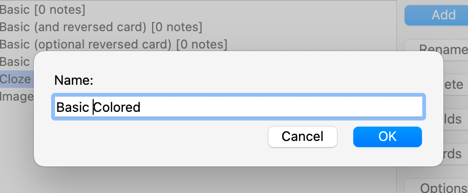
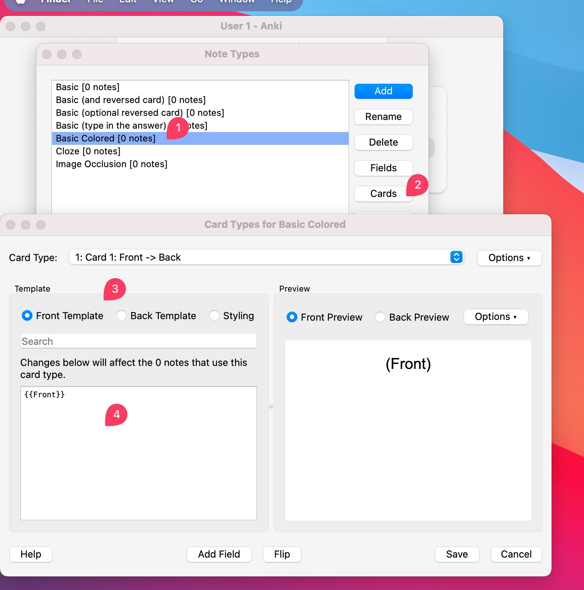
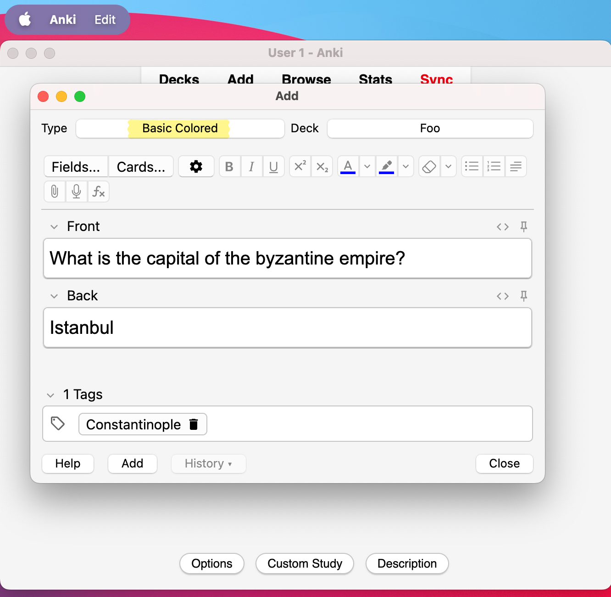

This is a theme I was using back in 2018/2019.  
I don't really know whose work is this and I tried to credit when/where I found the sources

# Preview

## Front card

## Back card

# How to install

1. Add a new note type. To do so, go on Tools > Manage node types > Add. The type should correspond to the type of note you want to add. I'll create a basic note here so I'll select basic. 

2. Open the corresponding folder under the `cards` folder (for instance `cards/basic`)
2. Set the name of the card; I usually just name it the type of the card followed by "colored"

3. Select the newly-created note type and click "Cards" 
4. paste the content of the `front.html` in the front template, the `back.html` in the back template and the `card.css` in the Styling part. Note that you need to delete all the previous content.

Now, when creating a new card, ensure to select the newly created card type

